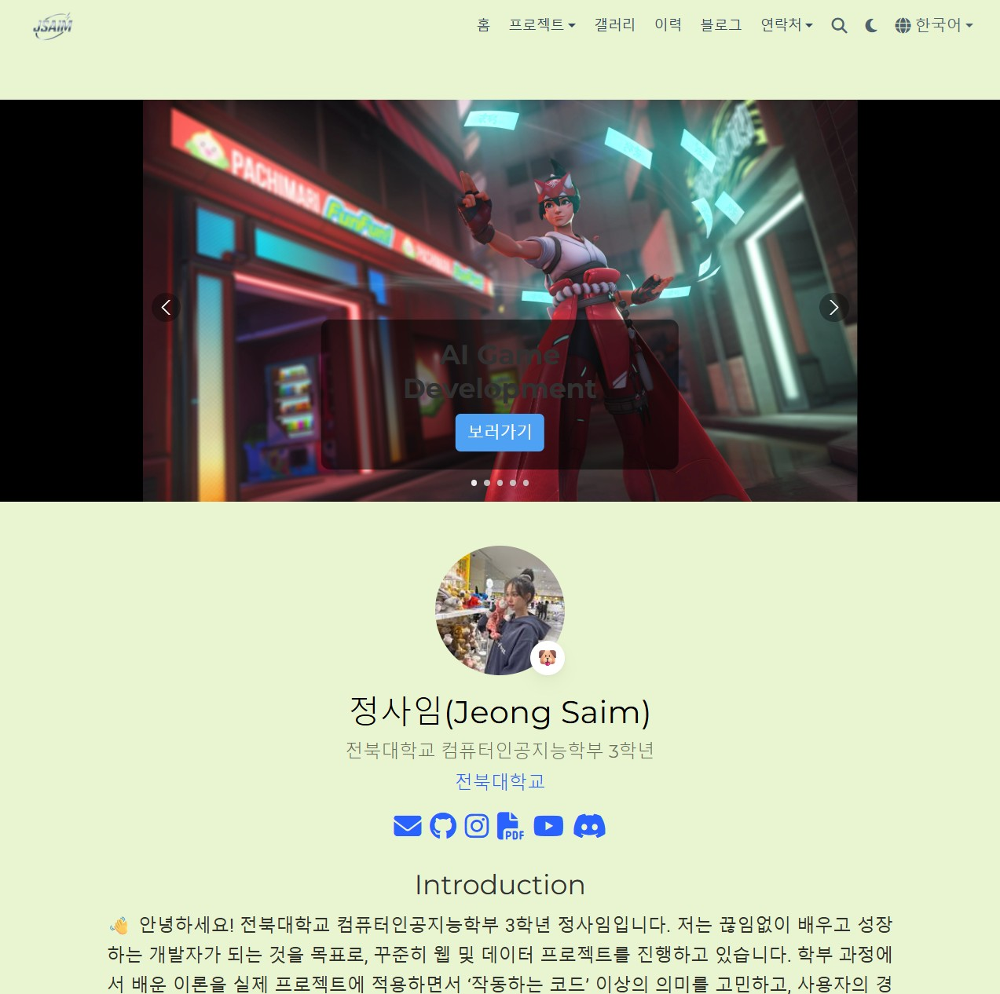

# [Jeong Saim — Portfolio Website](https://samingming.github.io)

나의 개인 포트폴리오 웹사이트는 **Hugo Portfolio Theme** (by [Wowchemy](https://hugoblox.com))를 기반으로 제작되었습니다.  
색상 테마, 레이아웃, 콘텐츠 구성을 자유롭게 바꿔 나만의 포트폴리오를 만들 수 있습니다 🎨

---

### 💡 Features

- 🧩 **Wowchemy no-code builder**로 위젯을 쉽게 조합해 구성 가능  
- 🌗 라이트 / 다크 테마 지원  
- 🌍 다국어 (한국어/영어) 페이지 구성  
- 🧠 연구/개발/디자인 프로젝트를 위한 포트폴리오 섹션  
- 📰 블로그와 갤러리, 이력서 페이지 포함  
- 🚀 GitHub Pages를 통한 무료 배포  

---

### 🧰 Tech Stack

- **Framework:** [Hugo](https://gohugo.io) (Static Site Generator)  
- **Theme:** [Wowchemy Hugo Portfolio Template](https://github.com/wowchemy/starter-hugo-portfolio-theme)  
- **Deploy:** GitHub Pages + GitHub Actions  
- **Language Packs:** 한국어 (ko), English (en)  

---

### 🌐 Demo & Documentation

- [📖 Wowchemy Docs](https://docs.hugoblox.com/)
- [🌈 Theme Gallery](https://hugoblox.com/hugo-themes/)
- [💬 Discord Community](https://discord.gg/z8wNYzb)
- [🐦 Follow @wowchemy](https://twitter.com/wowchemy)

---

### ❤️ Support Open Source

이 웹사이트는 오픈소스 **Wowchemy 프로젝트**에 기반합니다.  
지속 가능한 개발을 위해 아래 링크를 통해 후원할 수 있습니다.

👉 [**GitHub Sponsor 되기**](https://github.com/sponsors/gcushen)

---

### 🧩 Credits

- Theme: [Hugo Portfolio Template](https://github.com/wowchemy/starter-hugo-portfolio-theme)  
- Builder: [Hugo Blox Builder](https://github.com/HugoBlox/hugo-blox-builder)  
- Creator: [George Cushen](https://github.com/gcushen)  
- Maintained by: [Wowchemy Team](https://hugoblox.com)

---

> © 2025 [Jeong Saim](https://samingming.github.io)  
> Built with ❤️ using Hugo + Wowchemy
